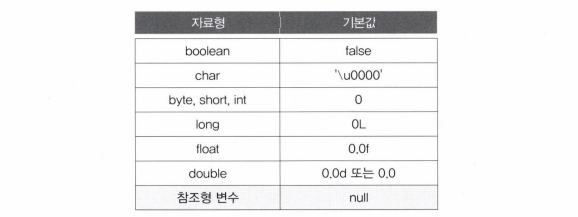

# Chapter 05 : 배열(Array)[↩](../../)

## contents📑<a id='contents'></a>

* 1_배열[👉](#1)
* 2_String배열[👉](#2)
* 3_다차원배열[👉](#3)

## 1_배열[📑](#contents)<a id='1'></a>

## 2_String배열[📑](#contents)<a id='2'></a>

### contents📑<a id='2_contents'></a>

* 2_1 String배열의 선언과 생성[✏](#2_1)
* 2_2 String 배열의 초기화[✏](#2_2)
* 2_3 char배열과 String클래스[✏](#2_3)
* 2_4 커맨드 라인을 통해 입력받기[✏](#2_4)

### 2_1 String배열의 선언과 생성[📑](#2_contents)<a id='2_1'></a>

* 배열의 타입이 `String`인 경우에도 `int`배열의 선언과 생성방법은 다르지 않음.
  * 예를 들어 3개의 문자열(String)을 담을 수 있는 배열을 생성하는 문장은 다음과 같다.

```java
String [] name = new String [3]; // 3개의 문자열을 담을 수 있는 배열을 생성한다.
```

* 위의 문장을 수행한 결과를 그림으로 표현하면 다음과 같음.
* 3개의 `String`타입의 참조변수를 저장하기 위한 공간이 마련되고 참조형 변수의 기본값은 `null`이므로 각 요소의 값은 `null`로 초기화 됨.


> **I 참고 I** null은 어떠한 객체도 가리키고 있지 않다는 뜻임.

* 참고로 변수의 타입에 따른 기본값은 다음과 같음.



> **표5-2** 타입에 따른 변수의 기본값(default value)

### 2_2 String 배열의 초기화[📑](#2_contents)<a id='2_2'></a>

* 초기화 역시 `int`배열과 동일한 방법으로 함.
* 아래와 같이 배열의 각 요소에 문자열을 지정하면 됨.

```java
String [] name = new String [3]; // 길이가 3인 String배열을 생성
name[0] = "Kim";
name[1] = "Park";
name[2] = "Yi";
```

* 또는 괄호{}를 사용해서 다음과 같이 간단히 초기화 할 수도 있음.

```java
String[] name = new String[]{"Kim", "Park", "Yi"};
String!] name = { "Kim", "Park", "Yi"}; // new String[]을 생략할수 있음
```


> **그림 5-4** 초기화된 String배열

* 특별히 String클래스만 "Kim"과 같이 큰따옴표만으로 간략히 표현하는 것이 허용되지만, 원래 String은 클래스이므로 아래의 왼쪽처럼 new연산자를 통해 객체를 생성해야함.

```java
String[] name = new String[3];
name[0] = new String("Kim");
name[1] = new String("Park");
name[2] = new String("Yi");
```

```java
String[] name = new String[3];
name[0] = "Kim";
name[1] = "Park";
name[2] = "Yi";
```

* **[그림5-4]** 도 편의상 간략히 그린 것이며, 원래는 아래와 같이 그려야 더 정확한 그림임.


* 배열에 실제 객체가 아닌 객체의 주소가 저장되어 있는 것을 볼 수 있음.
* 이처럼, 기본형 배열이 아닌 경우, 즉, 참조형 배열의 경우 배열에 저장되는 것은 객체의 주소임.
* 참조형 배열을 객체 배열이라고도 하는데, 다음 장인 '6장 객체지향개념 1'에서 배울 것임.

> **I 참고 I** 참조형 변수를 간단히 참조변수라고도 하며. 모든 참조형 변수에는 객체가 메모리에 저장된 주소인 4 byte의 정수 값(0x0〜0xffffffff) 또는 null이 저장된다.

```java
class ArrayEx12 {
	public static void main(String[] args) {
		String[] names = {"Kim", "Park", "Yi"};

		for(int i=0; i < names.length;i++) {
			System.out.println("names["+i+"]:"+names[i]);
		}

		String tmp = names[2]; // 배열 names의 세 번째요소를 tmp에 저장
		System.out.println("tmp:"+tmp);

		names[0] = "Yu"; // 배열 names의 첫 번째 요소를 "Yu"로 변경

		for(String str : names)   // 향상된 for문
			System.out.println(str);
	} // main
}

// 실행 결과
names[0]:Kim
names[1]: Park
names[2]:Yi
tmp:Yi
Yu
Park
Yi
```

> **예제 5-12** /ch5/ArrayEx12.java

```java
class ArrayEx13 {
	public static void main(String[] args) {
		char[] hex = { 'C', 'A', 'F', 'E'};

		String[] binary = {   "0000", "0001", "0010", "0011"
						    , "0100", "0101", "0110", "0111"
						    , "1000", "1001", "1010", "1011"
						    , "1100", "1101", "1110", "1111" };

		String result="";

		for (int i=0; i < hex.length ; i++ ) {		
			if(hex[i] >='0' && hex[i] <='9') {
				result +=binary[hex[i]-'0'];	   // '8'-'0'의 결과는 8이다.
			} else {	// A~F이면
				result +=binary[hex[i]-'A'+10]; // 'C'-'A'의 결과는 2
			}
		}

		System.out.println("hex:"+ new String(hex)); // String(char[] value)
		System.out.println("binary:"+result);
	}
}
// 실행 결과
hex: CAFE
binary:1100101011111110
```

> **예제 5-12** /ch5/ArrayEx13.java

* 16진수를 2진수로 변환하는 예제임.
  *  먼저 변환하고자 하는 16진수를 배열 `hex`에 나열함.
  * 16진수에는 A〜F까지 6개의 문자가 포함되므로 `char`배열로 처리함. 
  * 그리고 문자열 배열 binary에는 이진수 '0000' 부터 '1111'(16진수로 0〜F)까지 모두 16개의 값을 문자열로 저장함.
* `for문`을 이용해서 배열 `hex`에 저장된 문자를 하나씩 읽어서 그에 해당하는 이진수 표현을 배열 binary에서 얻어 `result`에 덧붙이고 그 결과를 화면에 출력함.

```java
result + = binary[hex[i]-’A’+10];
```

* i의 값이 0일 때, hex[0]의 값은 'C'이므로, 위의 문장은 다음과 같은 과정으로 계산됨.

```java
→ result + = binary [hex[0] —'A'+10];// hex[0]은 'C'
→ result + = binary['C'-'A'+10];// 'C' → ’A’ → 67 - 65 → 2
→ result + = binary [2 + 10];
→ result + = binary[12];
→ result + = "1100";
```

### 2_3 char배열과 String클래스[📑](#2_contents)<a id='2_3'></a>

* 지금까지 여러 문자, 즉 문자열을 저장할 때 String타입의 변수를 사용했음.
* 사실 문자열 이라는 용어는 '문자를 연이어 늘어놓은 것'을 의미하므로 문자배열인 char배열과 같은 뜻임.
* 그런데 자바에서는 `char`배열이 아닌 `String`클래스를 이용해서 문자열을 처리하는 이유는 `String`클래스가 `char`배열에 여 러 가지 기능을 추가하여 확장한 것이기 때문임.
* 그래서 `char`배열을 사용하는 것보다 `String`클래스를 사용하는 것이 문자열을 다루기 더 편리함.

```java   
String클래스는 char배열에 기능(메서드)을 추가한 것이다.
```

* C언어에서는 문자열을 char배열로 다루지만, 객체지향언어인 자바에서는 char배열과 그에 관련된 기능들을 함께 묶어서 클래스에 정의함.
  * 객체지향개념이 나오기 이전의 언어 들은 데이터와 기능을 따로 다루었지만, 객체지향언어에서는 데이터와 그에 관련된 기능을 하나의 클래스에 묶어서 다룰 수 있게 함.
  * 즉, 서로 관련된 것들끼리 데이터와 기능 을 구분하지 않고 함께 묶는 것임.
* 여기서 말하는 ‘기능’은 함수를 의미하며, 메서드는 객체지향 언어에서 ‘함수’ 대신 사용 하는 용어일 뿐 함수와 같은 뜻임.
  * 앞으로 ‘기능’이나 ‘함수’ 대신 ‘메서드’라는 용어를 사용할 것임. 
* char배열과 String클래스의 한 가지 중요한 차이가 있는데, String객체(문자열)는 읽을 수만 있을 뿐 내용을 변경할 수 없다는 것임.

```java
String str = "Java";
str = str + ”8”; 			// "Java8"이라는 새로운 문자열이 str에 저장된다.
System.out.printin(str); 	// "Java8"
```

* 위의 문장에서 문자열 `str`의 내용이 변경되는 것 같지만, 문자열은 변경할 수 없으므로 새로운 내용의 문자열이 생성됨.

> **I 참고 I** 변경 가능한 문자열을 다루려면. `StringBuffer`클래스를 사용하면 된다. 문자열에 대한 것은 9장에서 설명한다.

#### String클래스의 주요 메서드

* String클래스는 상당히 많은 문자열 관련 메서드들을 제공하지만 지금은 가장 기본적인 몇 가지만 살펴보고 나머지는 9장에서 자세히 다룰 것임.
* 자세히 이해하려 하지 말고 원하는 결과를 얻으려면 어떻게 코드를 작성해야하는지 정도만 이해하도록함.

| 메서드                                | 설명                                                         |
| ------------------------------------- | ------------------------------------------------------------ |
| `char charAt(int index)`              | 문자열에서 해당 위치 (index)에 있는 문자를 반환한다.         |
| `int length()`                        | 문자열의 길이를 반환한다.                                    |
| `String substring (int from, int to)` | 문자열에서 해당 범위 (from〜to)에 있는 문자열을 반환한다. (to는 범위에 포함되지 않음) |
| `boolean equals(Object obj)`          | 문자열의 내용이 obj와 같은지 확인한다. 같으면 결과는 true, 다 르면 false가 된다. |
| `char[ ] toCharArray()`               | 문자열을 문자배열 (char[ ])로 변환해서 반환한다              |

>  **표5-3** String클래스의 주요 메서드

* `charAt`메서드는 문자열에서 지정된 index에 있는 한 문자를 가져옴.
* 배열에서 ‘배열이름[index]’로 index에 위치한 값을 가져오는 것과 같다고 생각하면 됨.
* 배열과 마찬가지로 `charAt`메서드의 index값은 0부터 시작함.

```java
String str = "ABCDE";
char ch = str.charAt (3); // 문자열 str의 4번째 문자 'D' 를 ch에 저장.
```


* substring)은 문자열의 일부를 뽑아낼 수 있다. 주의할 것은 범위의 끝은 포함되지 않는 다는 것임.
  *  예를 들어, index의 범위가 1〜4라면 4는 범위에 포함되지 않음.

```java
String str = "012345";
String tmp = str.substring(1, 4);	// str에서 index범위 1~4의문자들을 반환
System.out.println(tmp);			// "123"이 출력된다.
```

* `equals()`는 이미 앞에서 간단히 배웠는데, 문자열의 내용이 같은지 다른지 확인하는데 사용함.
* 기본형 변수의 값을 비교하는 경우 `==`연산자를 사용하지만, 문자열의 내용을 비교할 때는 `equals()`를 사용해야 함.
  * 그리고 이 메서드는 대소문자를 구분한다는 점에 주의해야 함. 
  * 대소문자를 구분하지 않고 비교하려면 `equals()`대신 `equalsIgnoreCase()`를 사용해야함.

```java
String str = "abc”;
if(str.equals("abc")) { // str와 "abc"가내용이 같은지 확인한다.
	...
} 
```

#### char배열과 String클래스의 변환

* 가끔 char배열을 String클래스로 변환하거나, 또는 그 반대로 변환해야하는 경우가 있음.

```java
char[] chArr = { 'A', 'B', 'C' };
String str = new String (chArr); // char배열 → String
char[] tmp = str.toCharArray(); // String — char배열
```

```java
class ArrayEx14 {
	public static void main(String[] args) {
		String src = "ABCDE";

		for(int i=0; i < src.length(); i++) {
			char ch = src.charAt(i); // src의 i번째 문자를 ch에 저장
			System.out.println("src.charAt("+i+"):"+ ch);
		}

		char[] chArr = src.toCharArray();  // String을 char[]로 변환

		System.out.println(chArr); // char배열(char[])을 출력
	}
}

// 실행 결과
src.charAt(0):A
src.charAt(1):B
src.charAt(2):C
src.charAt(3):D
src.charAt(4):E
ABCDE
```

> **예제 5-14** /ch5/ArrayEx14.java

* String클래스의 `charAt(int idx)`을 사용하는 방법을 보여주는 예제임.
  * `charAt(int idx)`은 문자열 중에서 idx번째 위치에 있는 문자를 반환함. 
  * idx의 값은 배열처럼 0부터 시작 한다는 것을 확인함.
* 그리고 `println()`로 문자배열을 출력하면 문자열 출력하듯이 문자배열의 모든 요소를 이어서 한 줄로 출력한다.

```java
class ArrayEx15 {
	public static void main(String[] args) {
		String source = "SOSHELP";
		String[] morse = {".-", "-...", "-.-.","-..", "."
						,"..-.", "--.", "....","..",".---"
						, "-.-", ".-..", "--", "-.", "---"
						, ".--.", "--.-",".-.","...","-"
						, "..-", "...-", ".--", "-..-","-.--"
						, "--.." };

		String result="";

		for (int i=0; i < source.length() ; i++ ) {
			result+=morse[source.charAt(i)-'A'];
		}
		System.out.println("source:"+ source);
		System.out.println("morse:"+result);
	}
}
// 실행 결과
source:SOSHELP
morse:..---........-...--.
```

> **예제 5-15** /ch5/ArrayEx15.java

* 문자열(String)을 모르스(morse)부호로 변환하는 예제임.
* 이전의 16진수를 2진수로 변 환하는 예제와 같지만, char배열 대신 이번엔 String을 사용함.
* String의 문자의 개수는 length()를 통해서 얻을 수 있고, charAt(int i)메서드 는 String의 i번째 문자를 반환함.
* 그래서 for문의 조건식에 length()를 사용하고 charAt(int i)를 통해서 source에서 한 문자씩 차례대로 읽어 올 수 있음.

```java
resu丄t+= morse [source.charAt (i)— 'A' ];		// i가 0일 때
→ result+ = morse [source.charAt (0) ’ A’ ];	// source.charAt(0)는 첫 번째 문자
→ result+ = morse['S'-'A'];					// ’S’ - ’A’ → 83-65 → 18
→ result+ = morse [18];
→ results+ = "..." 								// result = result + "..."; 와 같다.
```

### 2_4 커맨드 라인을 통해 입력받기[📑](#2_contents)<a id='2_4'></a>

## 3_다차원배열[📑](#contents)<a id='3'></a>