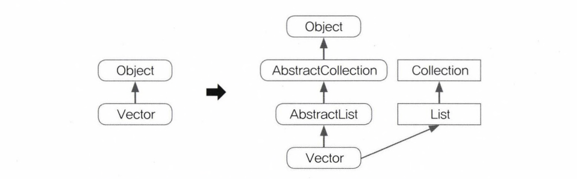

# Chapter 11 : 컬렉션 프레임웍(collections framework)[↩](../../)

## contents📑

* 1_컬렉션 프레임웍(Collections Framework)[👉](#1)
  * 1_1 컬렉션 프레임웍의 핵심 인터페이스[✏](#1_1)
  * 1_2 `ArrayList`[✏](#1_2)
  * 1_3 `LinkedList`[✏](#1_3)
  * 1_4 `Stack`과  `Queue`[✏](#1_4)
  * 1_5 `Iterator`, `ListIterator`,`Enumeration`[✏](#1_5)
  * 1_6 `Arrays`[✏](#1_6)
  * 1_7 `Comparator`와 `Comparable`[✏](#1_7)
  * 1_8 `HashSet`[✏](#1_8)
  * 1_9 `TreeSet`[✏](#1_9)
  * 1_10 `HashMap`과 `Hashtable`[✏](#1_10)
  * 1_11 `TreeMap`[✏](#1_11)
  * 1_12 `Properties`[✏](#1_12)
  * 1_13 `Collections`[✏](#1_13)
  * 1_14 컬렉션 클래스 정리 & 요약[✏](#1_14)

## 1_컬렉션 프레임웍(Collections Framework)[📑](#contents)

 컬렉션 프레임웍이란, '데이터 군(群)을 저장하는 클래스들을 표준화한 설계'를 뜻한다. 컬렉션(Collection)은 다수(多數)의 데이터, 즉 데이터 그룹을, 프레임웍은 표준화된 프로그래밍 방식을 의미한다.

>  **I 참고 I**  Java API문서에서는 컬렉션 프레임웍을 '데이터 군(群, group)을 다루고 표현하기 위한 단일화된 구조(architecture)' 라고 정의하고 있다. 

JDK1.2 이전까지는 `Vector`, `Hashtable`, `Properties`와 같은 컬렉션 클래스, 다수의 데이터를 저장할 수 있는 클래스,들을 서로 다른 각자의 방식으로 처리해야 했으나 JDK1.2부터 컬렉션 프레임웍이 등장하면서 다양한 종류의 컬렉션 클래스가 추가되고 모든 컬렉션 클래스를 표준화된 방식으로 다룰 수 있도록 체계화되었다. 

>  **I 참고 I** 앞으로 `Vector`와 같이 다수의 데이터를 저장할 수 있는 클래스를 '컬렉션 클래스'라고 하겠다. 

컬렉션 프레임웍은 컬렉션, 다수의 데이터, 을 다루는 데 필요한 다양하고 풍부한 클래스들을 제공하기 때문에 프로그래머의 짐을 상당히 덜어 주고 있으며, 또한 인터페이스와 다형성을 이용한 객체지향적 설계를 통해 표준화되어 있기 때문에 사용법을 익히기에도 편리하고 재사용성이 높은 코드를 작성할 수 있다는 장점이 있다.

### 1_1 컬렉션 프레임웍의 핵심 인터페이스[📑](#contents)

컬렉션 프레임웍에서는 컬렉션데이터 그룹을 크게 3가지 타입이 존재한다고 인식하고 각 컬렉션을 다루는데 필요한 기능을 가진 3개의 인터페이스를 정의하였다. 그리고 인터페이스 `List`와 `Set`의 공통된 부분을 다시 뽑아서 새로운 인터페이스인 `Collection`을 추가로 정의하였다.

> **그림11-1** 컬렉션 프레임웍의 핵심 인터페이스간의 상속계층도

인터페이스 `List`와 `Set`을 구현한 컬렉션 클래스들은 서로 많은 공통부분이 있어서, 공통된 부분을 다시 뽑아 `Collection`인터페이스를 정의할 수 있었지만 `Map`인터페이스는 이 들과는 전혀 다른 형태로 컬렉션을 다루기 때문에 같은 상속계층도에 포함되지 못했다. 

이러한 설계는 객체지향언어의 장점을 극명히 보여주는 것으로 객체지향개념을 학습하는 사람들에게 많은 것을 느끼게 한다. 후에 프로그래밍 실력을 어느 정도 갖추게 되었을 때 컬렉션 프레임웍의 실제 소스를 분석해보면 객체지향적인 설계능력을 향상시키는데 많은 도움이 될 것이다.

> **I 참고 I** JDK1.5부터` Iterable`인터페이스가 추가되고 이를 `Collection`인터페이스가 상속받도록 변경되었으나 이것은 단지 인터페이스들의 공통적인 메서드인 `iterator()`를 뽑아서 중복을 제거하기 위한 것에 불과하므로 상속계층도에서 별 의미가 없다

| 인터페이스 | 특 징                                                        |
| ---------- | ------------------------------------------------------------ |
| `List`     | 순서가 있는 데이터의 집합, 데이터의 중복을 허용한다. 구현클래스 : `ArrayList`, `LinkedList`, `Stack`, `Vector` 등 |
| `Set`      | 순서를 유지하지 않는 데이터의 집합. 데이터의 중복을 허용하지 않는다. 구현클래스 : `HashSet`, `TreeSet` 등 |
| `Map`      | 키(key)와 값(value)의 쌍(pair)으로 이루어진 데이터의 집합 순서는 유지되지 않으며, 키는 중복을 허용하지 않고, 값은 중복을 허용한다. 예) 우편번호, 지역번호(전화번호) 구현클래스 : `HashMap`, `TreeMap`, `Hashtable`, `Properties` 등 |

> **표 11-1** 컬렉션 프레임웍의 핵심 인터페이스와 특징

> **I 참고 I** 키(Key)란. 데이터 집합 중에서 어떤 값(value)을 찾는데 열쇠(key)가 된다는 의미에서 붙여진 이름이다. 그래서 키 (Key)는 중복을 허용하지 않는다.

실제 개발 시에는 다루고자 하는 컬렉션의 특징을 파악하고 어떤 인터페이스를 구현한 컬렉션 클래스를 사용해야하는지 결정해야하므로 위의 **표11-1**에 적힌 각 인터페이스의 특징과 차이를 잘 이해하고 있어야 한다. 

컬렉션 프레임웍의 모든 컬렉션 클래스들은 `List`, `Set`, `Map` 중의 하나를 구현하고 있으며, 구현한 인터페이스의 이름이 클래스의 이름에 포함되어있어서 이름만으로도 클래스의 특징을 쉽게 알 수 있도록 되어있다.

그러나 `Vector`, `Stack`, `Hashtable`, `Properties`와 같은 클래스들은 컬렉션 프레임웍이 만들어지기 이전부터 존재하던 것이기 때문에 컬렉션 프레임웍의 명명법을 따르지 않는다.

`Vector`나 `Hashtable`과 같은 기존의 컬렉션 클래스들은 호환을 위해, 설계를 변경해서 남겨두었지만 가능하면 사용하지 않는 것이 좋다. 그 대신 새로 추가된 `ArrayList`와 `HashMap`을 사용하자.

> **그림 11-2** Vector클래스의 상속계층도 변화 - 왼쪽이 JDK1.2 이전, 오른쪽이 이후

#### Collection인터페이스

`List`와 `Set`의 조상인 Collection인터페이스에는 다음과 같은 메서드들이 정의되어 있다.

| 메서드                                                       | 설 명                                                        |
| ------------------------------------------------------------ | ------------------------------------------------------------ |
| boolean add(Object o) boolean addAll(Collection c)      | 지정된 객체(o) 또는 Collection(c) 의 객체들을 Collection에 추가한다. |
| void clear()                                                 | Collection의 모든 객체를 삭제한다.                           |
| boolean contains(Object o) boolean containsAll(Collection o) | 지정된 객체(o) 또는 Collection의 객체들이 Collection에 포함되어 있는지 확인한다. |
|                                                              |                                                              |
|                                                              |                                                              |
|                                                              |                                                              |
|                                                              |                                                              |
|                                                              |                                                              |
|                                                              |                                                              |
|                                                              |                                                              |
|                                                              |                                                              |
|                                                              |                                                              |
|                                                              |                                                              |

